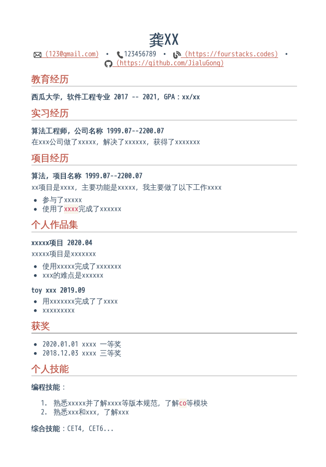

# Markdown Resume

### Description
A markdown resume template, the template is originally from [resume.md](https://github.com/mikepqr/resume.md) and the theme is inspired by [even](https://github.com/getzola/even)

### How to use
1. Complete the `./mds/resume.md`
2. Then run the node scripts，you should have a Node environment first
   ```shell
   $ cd node-scripts
   $ npm install
   $ node index.js
   ```
   and you will get the `resume.pdf` in pdfs
3. You can change the style of the resume by changing the `resume.css`


a example:
